

# INTRODUCTION

BikeBook is an online bike rental system. A company named bikebook offers multiple categories of bikes for rent for people around the country. So we have designed an application from where the customer can register to rent their desirable bike or bicycle for a specific time.       
This is a simple web-based open source software written in HTML, CSS, JavaScript(React) and Nodejs.

If you find any bug or added new feature feel free to send a pull request.

If you have any suggestions feel free create issues.
<ul>
  <li><a href="#1.1 Purpose">Purpose</li> 
  <li><a href="#1.2 Features">Features</li> 
  <li><a href="#1.3 Technology">Technology</li> 
  <li><a href="#Screen Shot">Screen Shot</li> 
  <li><a href="#Installation">Installation</li> 
</ul>
  
  
## 1.1 Purpose 
From the BikeBook people would be able to rent the bike from a specific renting point. And they can rent the bike for that specific time period and after their use, they can submit the bike on some specific points. This will solve many problems. Now people do need to avoid owning a bike to ride. They can rent a bike and ride as much as they want. This will also benefit traffic management. As a two-wheeled vehicle is less prone to create traffic jams.

## 1.2 Features
1. Admins can login to the admin dashboard. 
2. Customers can login. 
3. Customers can login with their google and facebook account. 
4. Admin can add another Admin. 
5. Customers can sign up. 
6. Customers and Admin can reset their password. 
7. To sign up a customer must upload his/her NID/Passport/DOB certificate to ensure the identity. 
8. For motor bike booking customers must provide their driving license. 
9. Customers can rent one or more bikes at a time. 
10. The company will have multiple pickup points from where the customer can book bikes. 
11. Customers can select the pickup date and return date. 
12. The total money amount will be calculated based on the selected booking time. 
13. Customers can search for their desired bike. 
14. There will be a list of the highest rated and most popular bike sections. 
15. Customers can see testimonials of the previous customers. 
16. Customers can subscribe to the newsletter for receiving any offer. 
17. Admin can add a new bike. 
18. Admin can delete old bikes. 
19. Admin can update previous bike information. 
20. Customers can not book a bike if it’s already booked in the given schedule. 
21. Already booked bike will be hidden when a customer selects that date and time period. 
22. There will be a how it works section where it will describe how the process works. 
23. Customers can make payment using their cards. 
24. Customers will get a unique transaction id for every booking. 
25. Customers can see their booking history. 
26. Customers will be charged if they fail to return the bike within the booking period. 
27. Admin can delete, update user information. 
28. There will be a map indicating every pickup point. 
29. There will be a logout method to log out from the system. 

## 1.3 Technology
<b>Programming Language</b> 
For this project we will be using React js which is a framework of JavaScript for the frontend development of the application. As we know that React is the best option out there right now for frontend development because it provides a  huge opportunity of working with the interactivity of the website. 
We will be using Node.js + Express.js as the backend programming language. Which provides great support in working with a full JavaScript environment.

<b>Database</b> 
We will be using MongoDB as our Database management system. MongoDB is one of the most popular Database management systems out there right now. What makes it more versatile than another typical RDBMS is it's more reliable considering the advancement of technology. MongoDB is a database that is more advanced and capable of handling big data with dynamic schema features. We will use Mongoose, which is a Object Data Modeling library for MongoDB and Node.js. It provides a straight-forward, schema based solution to model Application data and includes support for middleware, validations and type coercion.

<b>Others</b> 
We will be using basic CSS and its framework Bootstrap 4, which provides various options for playing with the style. We will use Redux as our state management tool. Other than those, we have use bcrypt to hash our password, dot env to load our environment variables, Json Web Token(JWT) for authorization and authentication purpose. We have used cookie parser for parsing HTTP cookies and Multer for handling file uploads.

# Diagrams

## Use Case Diagram

## Class Diagram

## Activity Diagram

## Sequence Diagram

## ER Diagram

# SCREEENSHOTS

## Homepage
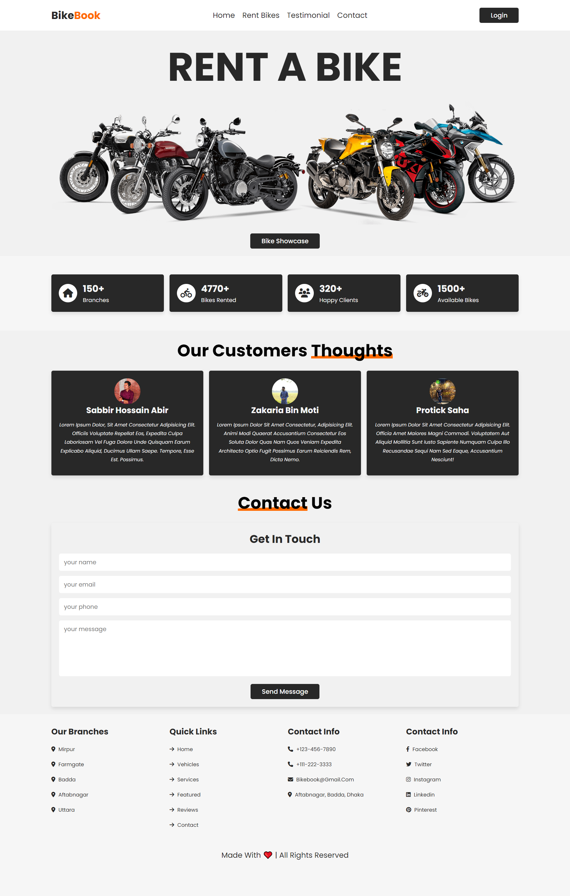

## User Login Page
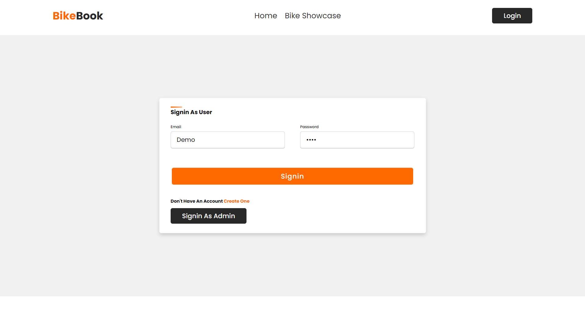

## User Signup Page
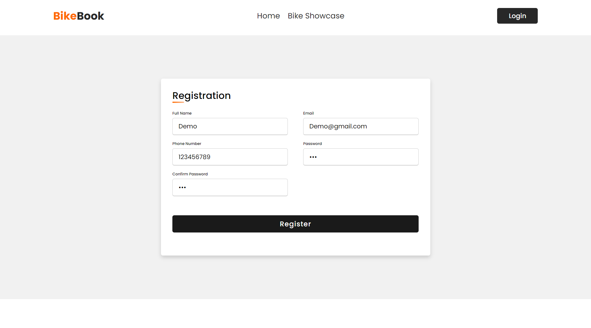

## Admin Signin
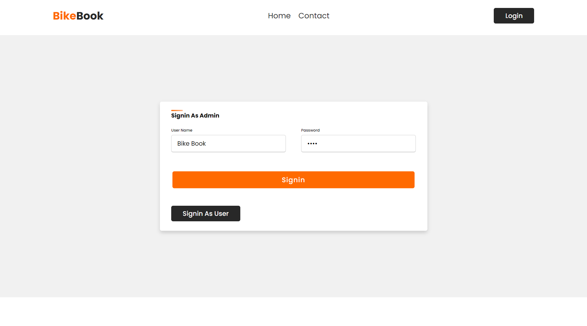

## Explore Bikes
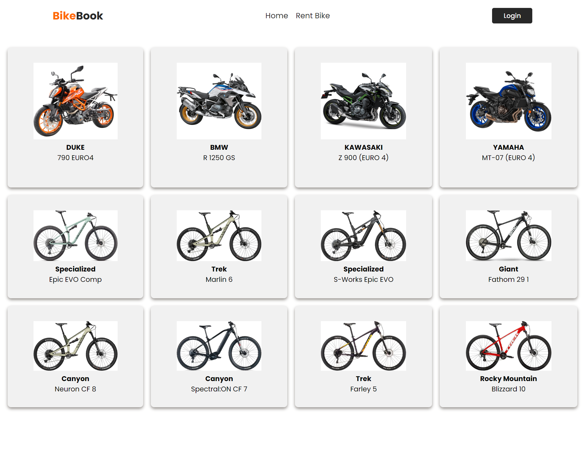

## Rent Bikes
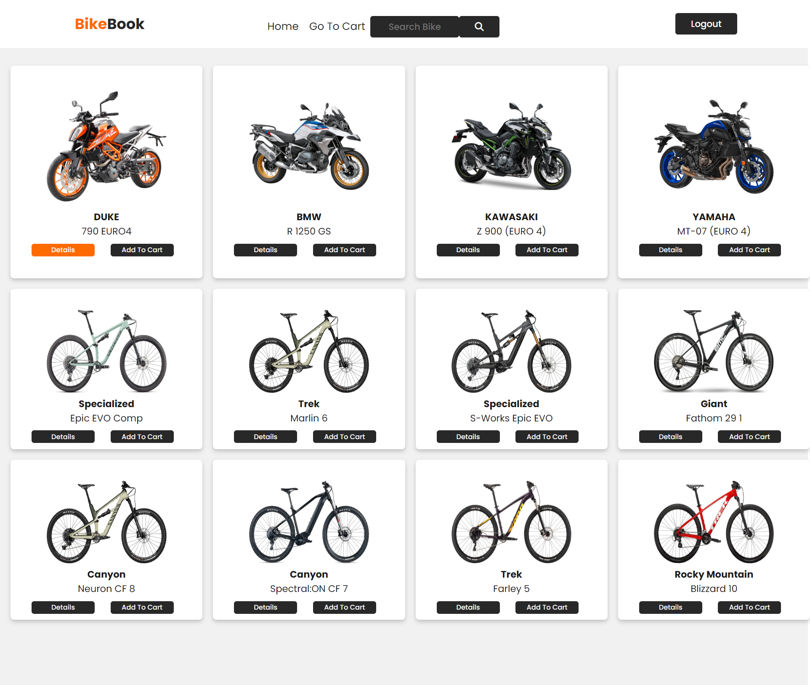

## Cart
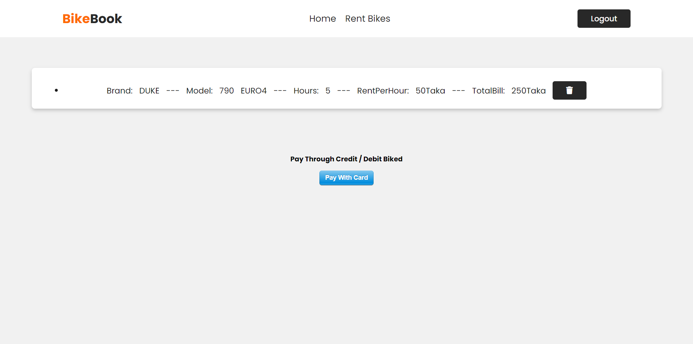

## Review
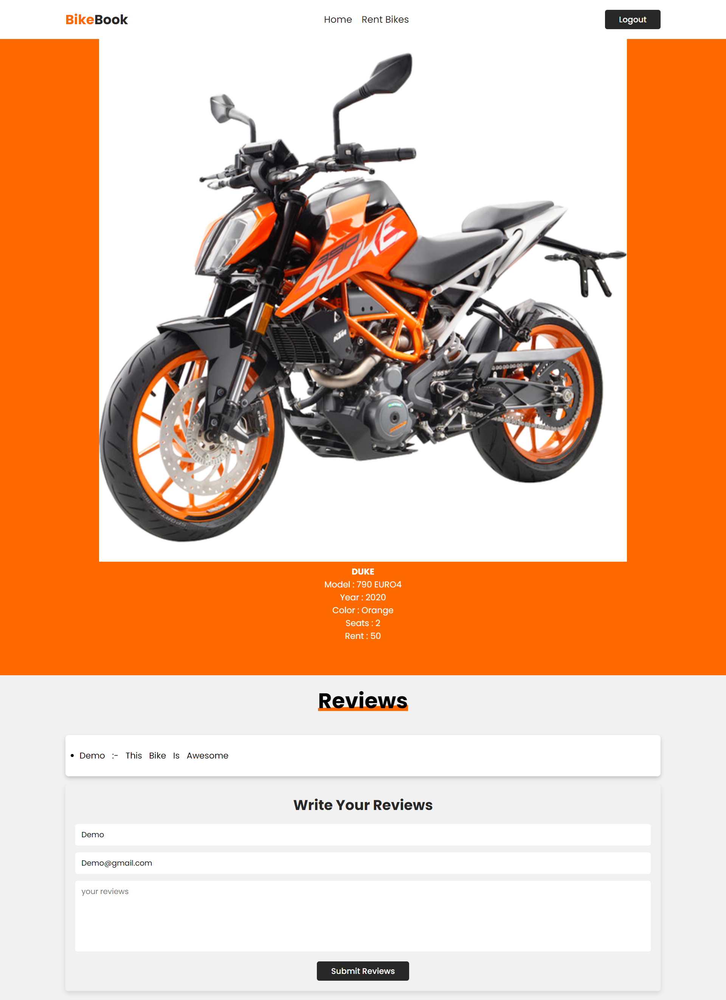

## Admin Dashboard
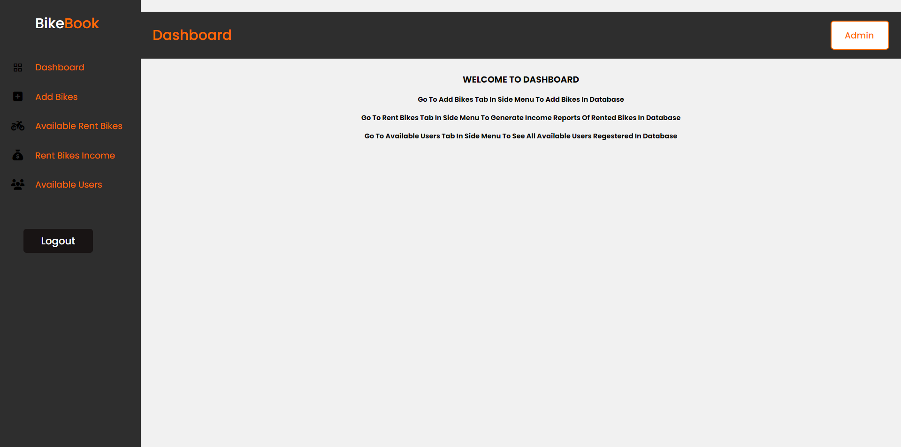

## Add Bikes
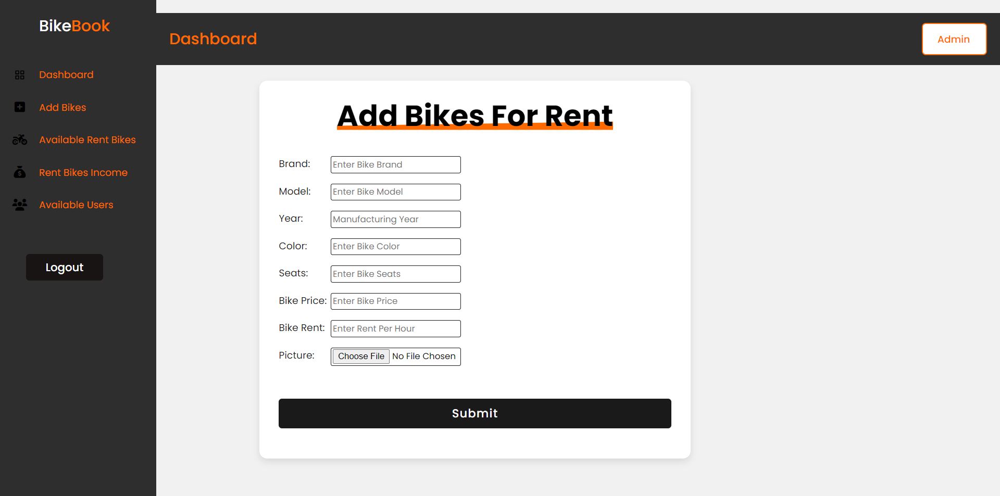

## Available Bikes for rent
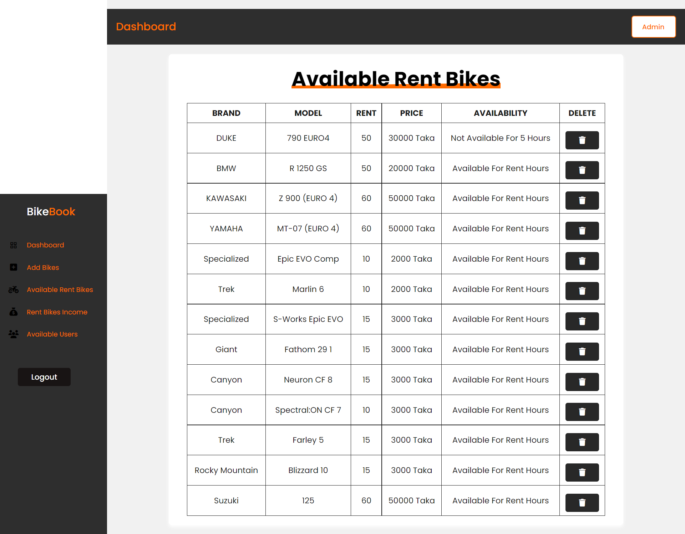

## Icome Statements
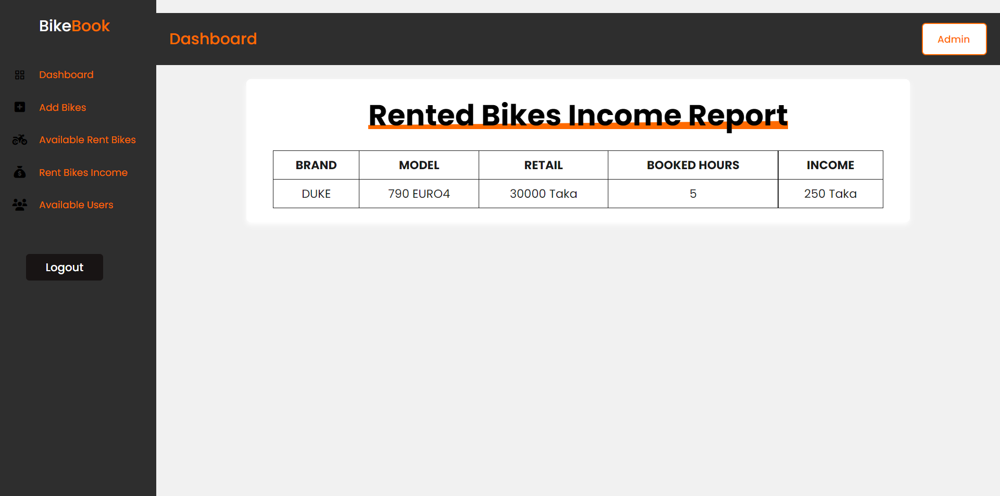

## Available Users
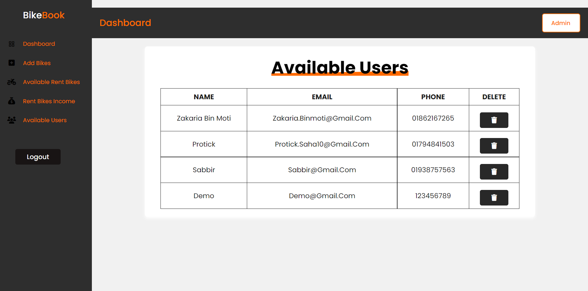
